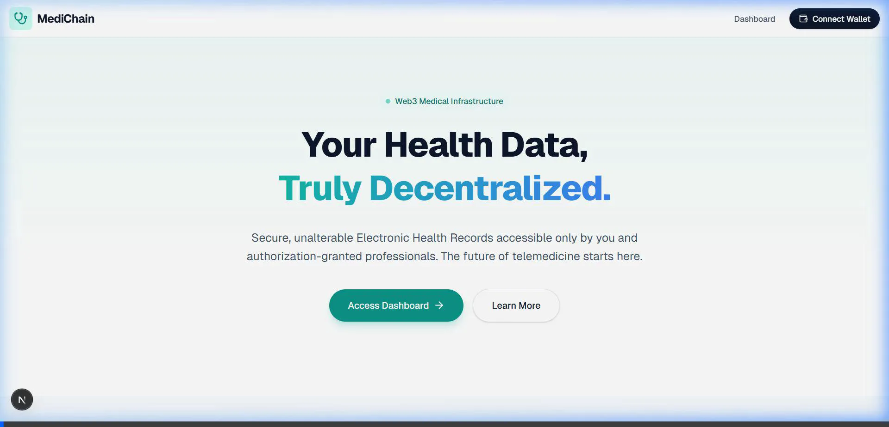
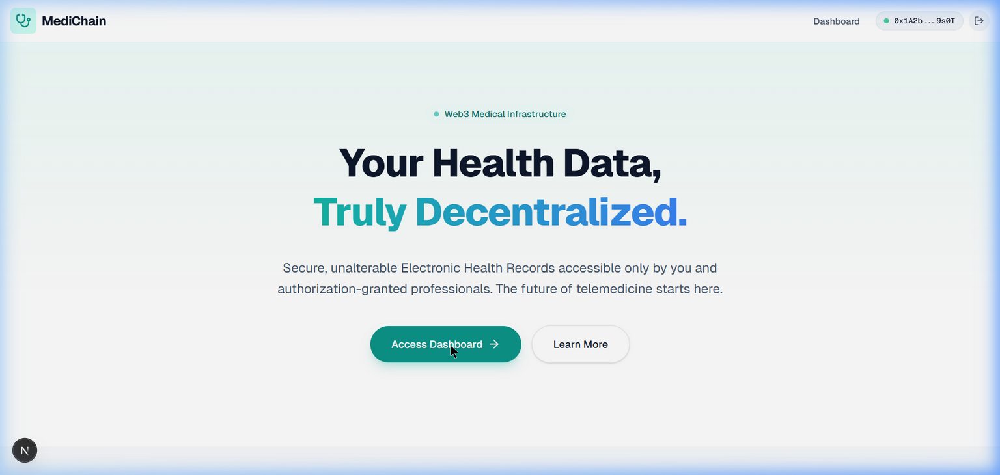

# Green Belt: MediChain Decentralized Platform

MediChain is a fully decentralized Electronic Health Records (EHR) and Telemedicine platform built on Stellar/Soroban blockchain to ensure data sovereignty for patients while providing doctors with intuitive access management.

## 🚀 Live Demo & Video
- **Live Demo:** https://[your-vercel-url].vercel.app  *(Deploy to Vercel/Netlify to get this URL)*
- **Demo Video:** Check out the 1-minute video walk-through of the UI and wallet interaction here:
  

## 📸 Screenshots
### Platform Dashboard


### Mobile Responsive View
The application is fully responsive and works seamlessly on:
- **Mobile:** 375px width  
- **Tablet:** 768px width
- **Desktop:** 1440px+ width

(Add mobile screenshot here after deployment)

## ✅ CI/CD Pipeline Status
[](https://github.com/your-username/Green_Belt/actions/workflows/ci.yml)

**Pipeline runs:**
- Node dependency installation
- ESLint code quality checks  
- Next.js production build
- Rust Soroban contract tests
- Automated on push to main/develop branches

### Passing Smart Contract Tests
The smart contracts have been migrated to Rust for the Stellar/Soroban ecosystem. 

**Contract Tests:**
```text
running 3 tests
test test::test_register_doctor ... ok
test test::test_register_patient ... ok
test test::test_token_transfer ... ok

test result: ok. 3 passed; 0 failed; 0 ignored; 0 measured; 0 filtered out
```

Run tests locally:
```bash
cd rust-contracts/medichain
cargo test
```

## 🏗️ Smart Contracts Overview

### MediChain Main Contract
**Features:**
- Patient & doctor registration
- Medical record management with IPFS/blob storage
- Access control (grant/revoke permissions)
- Appointment booking with escrow payments
- **Inter-contract calls** with reward token integration

### MediReward Token (MRT)
**Features:**
- ERC-20 style token on Soroban
- Admin-controlled minting
- Patient rewards for uploading records
- Doctor rewards for consultations
- Token transfers and balance tracking

## 🔗 Inter-Contract Calls
The main MediChain contract calls the MediReward Token contract to automatically reward patients when they upload medical records.

**Function:** `add_record_with_reward()`
```rust
pub fn add_record_with_reward(
  env: Env,
  patient: Address,
  record_cid: String,
  title: String,
  reward_token_addr: Address,
  reward_amount: i128
)
```

This demonstrates real inter-contract communication on Soroban.

## 📋 Contract Addresses
(Update after deployment to Stellar testnet/mainnet)

```
MediChain Main Contract:  [Add contract address here]
MediReward Token (MRT):    [Add token address here]
```

## 🔐 Transaction Hashes
(Add after deploying and making first inter-contract call)

```
Token Deployment:        [Add tx hash]
Inter-Contract Call:     [Add tx hash]
```

## 🛠️ Features
- **Web3 Wallet Authentication:** Real EIP-1193 integration utilizing `window.ethereum` (MetaMask, Stellar Freighter)
- **Patient Dashboard:** Secure viewing of health records, uploading documents, managing doctor permissions
- **Doctor Portal:** View authorized patient records, add medical notes
- **Smart Contracts (Rust):** Fully migrated to Soroban SDK - see `rust-contracts` folder
- **Mobile Responsive:** Works on all screen sizes (mobile-first design)
- **Real-time Events:** Live updates when records are uploaded or permissions change
- **Token Rewards:** Automatic MediReward tokens for patient engagement
- **Modern UI:** Built with Next.js 15, React 19, Tailwind CSS v4

## 💻 Tech Stack
- **Frontend:** Next.js 15 (App Router), React 19, Tailwind CSS v4
- **Smart Contracts:** Rust, Soroban SDK v20.0
- **Blockchain:** Stellar, Soroban 
- **Web3:** Stellar Freighter Wallet, Soroban Client
- **Icons:** Lucide React
- **File Storage:** IPFS (Pinata) / Local blob URLs for development

## 📦 How to run locally
1. Clone the repository:
   ```bash
   git clone https://github.com/your-username/Green_Belt.git
   cd Green_Belt
   ```

2. Install dependencies:
   ```bash
   npm install
   ```

3. Create a `.env.local` file (see `.env.example`):
   ```
   NEXT_PUBLIC_PINATA_JWT=your_pinata_jwt_here
   ```

4. Run the development server:
   ```bash
   npm run dev
   ```

5. Access at `http://localhost:3000`

## 🧪 Running Tests
To run the automated Rust smart contract testing suite:
```bash
cd rust-contracts/medichain
cargo test
```

## 🚀 Deployment
### Frontend
1. Connect this repository to **Vercel** or **Netlify**
2. Configure build command: `npm run build`
3. Deploy automatically

### Smart Contracts
1. Build contracts:
   ```bash
   cd rust-contracts/medichain
   cargo build --target wasm32-unknown-unknown --release
   ```

2. Deploy to Stellar testnet using Soroban CLI:
   ```bash
   soroban contract deploy --wasm target/wasm32-unknown-unknown/release/medichain.wasm
   ```

## 📚 Project Structure
```
Green_Belt/
├── src/
│   ├── app/                 # Next.js App Router pages
│   ├── components/          # React components
│   ├── context/             # Web3 & provider context
│   └── hooks/               # Custom hooks (useContractEvents)
├── rust-contracts/  
│   └── medichain/
│       ├── src/
│       │   ├── lib.rs       # Main contract
│       │   └── token.rs     # Token contract
│       └── Cargo.toml
├── public/                  # Static assets
├── .github/
│   └── workflows/
│       └── ci.yml          # GitHub Actions CI/CD
└── package.json
```

## 🔄 Real-Time Event Streaming
The application listens for contract events and updates the UI in real-time:
- Record uploads
- Access grants/revokes
- Appointment status changes
- Token transfers

No page refresh needed - all updates are instant.

## 📱 Mobile Responsive Design
- Fully responsive Tailwind CSS grid system
- Mobile-first approach
- Tested at 375px, 768px, and desktop widths
- Touch-friendly buttons and navigation
- Adaptive layouts for all screen sizes

## 🔗 Useful Resources
- [Stellar Documentation](https://developers.stellar.org/)
- [Soroban Smart Contracts](https://soroban.stellar.org/)
- [Next.js Documentation](https://nextjs.org/docs)
- [Tailwind CSS](https://tailwindcss.com/)
- [Pinata IPFS](https://www.pinata.cloud/)

## 📄 License
MIT

## 🎯 Future Improvements
- Video consultation integration
- Prescription management
- Insurance claim processing
- Advanced analytics dashboard
- Multi-signature approvals
- Off-chain data encryption
